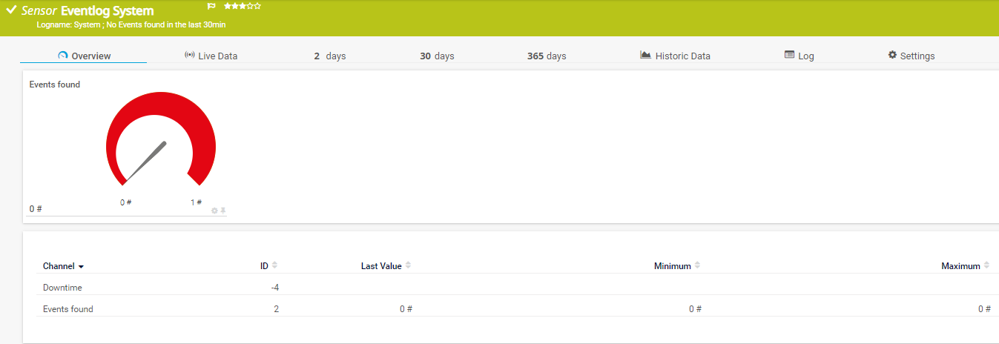
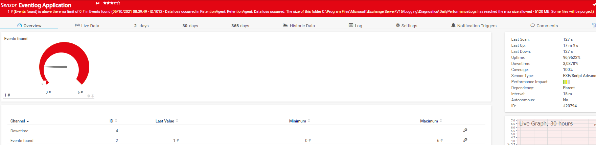

# PRTG-WinEvent

## Project Owner:

Jannos-443

## Project Details

This Sensor Monitors Windows Eventlog.
You can select a specific LogName or ProviderName.
You can decide which Eventtype counts for example only Error and Critical.
You can exclude IDs, Providers and Messages.

## HOW TO

1. Place `PRTG-WinEvent.ps1` under `C:\Program Files (x86)\PRTG Network Monitor\Custom Sensors\EXEXML`

2. Create new Sensor

   | Settings | Value |
   | --- | --- |
   | EXE/Script | PRTG-WinEvent.ps1 |
   | Parameters | -ComputerName %host + at least -LogName or -ProviderName |
   | Security Context | Use Windows credentials of parent device |
   | Scanning Interval | 15 minutes |

The script got variables to global exclude events for all devices or parameter to exclude events for special devices.

## Default global excludes

   | Exclude | Reason |
   | --- | --- |
   | ID = 10016 | MS by design |
   | Provider = Microsoft-Windows-Perflib | unnecessary |
   

## Examples
Example Call: 

`PRTG-WinEvent.ps1 -Computername '%host' -LogName "Application" -TimeAgo 30 -LogLevel "CE" -ExcludeID '^(3025|3018)$'`

## FAQ

### The RPC server is unavailable
If you got "The RPC server is unavailable" error, try to enable the Windows Firewall Rule "Remote Event Log Management (RPC)" on the remote Server 

### How to get Provider Names
List all Providers of a Server:
 `Get-WinEvent -ListProvider * | Select Name`
 
List Providers with *perflib* in its Name
 `Get-WinEvent -ListProvider *perflib*`
 
### How to get Log Names
List all Logs of a Server:
 `Get-WinEvent -ListLog *`
 
List Logs with *perf* in its Name
 `Get-WinEvent -ListLog *perf*`

### exclude Syntax
For more information about regular expressions in PowerShell, visit [Microsoft Docs](https://docs.microsoft.com/en-us/powershell/module/microsoft.powershell.core/about/about_regular_expressions).

".+" is one or more charakters
".*" is zero or more charakters
